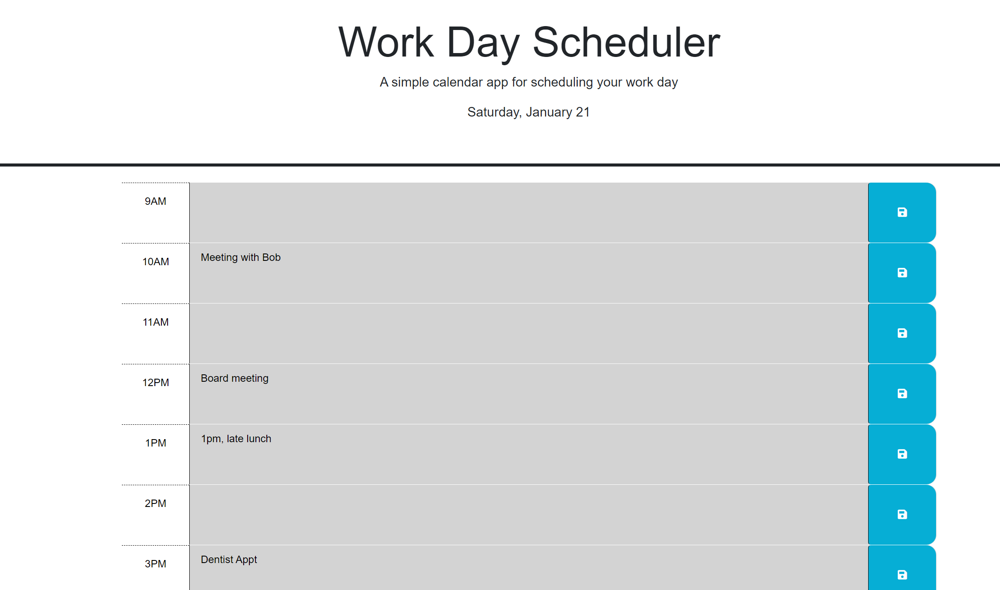

# Temporal Stepladder

## Description

A web-based simple tool for organizing a single day, and storing notes. The main motiviation for me in pursuing this project was to practice using JQuery to iterate across items in the dom, and to get some experience using a date library.

## Usage

Application runs within the browser - to use, simply jot down notes for the relevant hour and click the save button. When you navigate back to the page later, the notes will still be there!

## Credits

This project was unique in that I didn't need to reference many things outside of the class notes to accomplish the end goal. I did reference one StackOverflow post to figure out how to return just a portion of an element's id, which was helpful in consolidating one step.

[Return the value at the end of an ID: StackOverflow](https://stackoverflow.com/questions/3722360/get-part-of-a-string-using-jquery)

## License

Please refer to the license in the repo.
